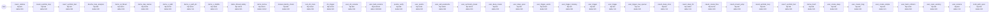

# Stage3 Probe Flow Graph

```mermaid
flowchart LR
  P1["case1_relative\nfilp:9/9\ndalloc:0/0"]
  P2["case6_symlink_loop\nfilp:9/9\ndalloc:0/0"]
  P3["case7_symlink_fast\nfilp:9/9\ndalloc:0/0"]
  P4["dcache_loop_analysis\nfilp:8/8\ndalloc:0/0"]
  P5["demo_at_fdcwd\nfilp:11/11\ndalloc:0/0"]
  P6["demo_dup_names\nfilp:10/10\ndalloc:0/0"]
  P7["demo_o_path\nfilp:10/10\ndalloc:0/0"]
  P8["demo_o_path_dir\nfilp:11/11\ndalloc:1/1"]
  P9["demo_o_tmpfile\nfilp:11/11\ndalloc:1/1"]
  P10["demo_thread_safety\nfilp:13/13\ndalloc:5/5"]
  P11["demo_toctou\nfilp:21/21\ndalloc:12/12"]
  P12["manual_dentry_check\nfilp:8/8\ndalloc:0/0"]
  P13["test_vfs_trace\nfilp:12/12\ndalloc:0/0"]
  P14["vfs_trigger\nfilp:10/10\ndalloc:0/0"]
  P15["user_dir_rename\nfilp:8/8\ndalloc:0/0"]
  P16["user_bulk_rename\nfilp:110/110\ndalloc:100/100"]
  P17["puzzle_verify\nfilp:8/8\ndalloc:0/0"]
  P18["user_puzzle\nfilp:11/11\ndalloc:0/0"]
  P19["user_salt_avalanche\nfilp:10/10\ndalloc:0/0"]
  P20["user_symmetry_break\nfilp:10/10\ndalloc:0/0"]
  P21["user_deep_create\nfilp:9/9\ndalloc:0/0"]
  P22["user_deep_open\nfilp:9/9\ndalloc:0/0"]
  P23["user_trigger_exists\nfilp:10/10\ndalloc:0/0"]
  P24["user_trigger_missing\nfilp:9/9\ndalloc:0/0"]
  P25["user_trigger\nfilp:9/9\ndalloc:0/0"]
  P26["user_trigger\nfilp:9/9\ndalloc:1/1"]
  P27["user_trigger_raw_openat\nfilp:1/1\ndalloc:0/0"]
  P28["case2_deep_miss\nfilp:9/9\ndalloc:1/1"]
  P29["case3_deep_hit\nfilp:10/10\ndalloc:1/1"]
  P30["case4_create_flow\nfilp:10/10\ndalloc:0/0"]
  P31["case5_mount_jump\nfilp:9/9\ndalloc:0/0"]
  P32["case6_symlink_loop\nfilp:9/9\ndalloc:0/0"]
  P33["case7_symlink_fast\nfilp:9/9\ndalloc:0/0"]
  P34["derive_hash\nfilp:8/8\ndalloc:0/0"]
  P35["user_create_deep\nfilp:9/9\ndalloc:0/0"]
  P36["user_create_long\nfilp:9/9\ndalloc:0/0"]
  P37["user_create_simple\nfilp:9/9\ndalloc:1/1"]
  P38["user_hash_collision\nfilp:11/11\ndalloc:0/0"]
  P39["user_open_existing\nfilp:9/9\ndalloc:0/0"]
  P40["user_rename\nfilp:9/9\ndalloc:1/1"]
  P41["multi_path_open\nfilp:9/9\ndalloc:0/0"]
  START((start))
  START --> P1
  P1 --> P2
  P2 --> P3
  P3 --> P4
  P4 --> P5
  P5 --> P6
  P6 --> P7
  P7 --> P8
  P8 --> P9
  P9 --> P10
  P10 --> P11
  P11 --> P12
  P12 --> P13
  P13 --> P14
  P14 --> P15
  P15 --> P16
  P16 --> P17
  P17 --> P18
  P18 --> P19
  P19 --> P20
  P20 --> P21
  P21 --> P22
  P22 --> P23
  P23 --> P24
  P24 --> P25
  P25 --> P26
  P26 --> P27
  P27 --> P28
  P28 --> P29
  P29 --> P30
  P30 --> P31
  P31 --> P32
  P32 --> P33
  P33 --> P34
  P34 --> P35
  P35 --> P36
  P36 --> P37
  P37 --> P38
  P38 --> P39
  P39 --> P40
  P40 --> P41
```
